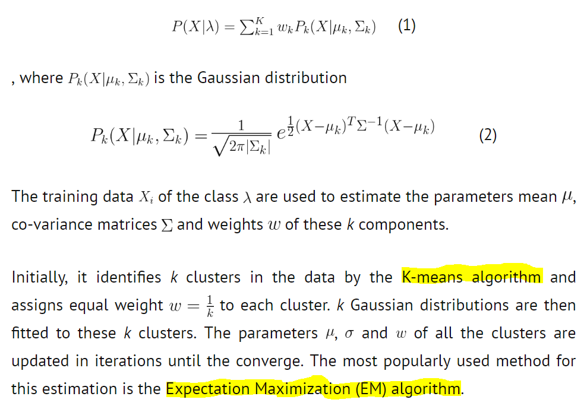
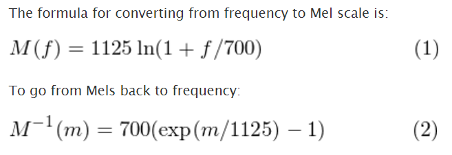

# Must

- **[Vidéo : Fourier, Laplace et compagnie (I) - Sinus, complexes et Cie]**: https://www.youtube.com/watch?v=cn8nhH5_-EM

- **[An Interactive Guide To The Fourier Transform]**: https://betterexplained.com/articles/an-interactive-guide-to-the-fourier-transform/

- **[Jupyter Notebook on Music Information Retrieval]**: https://musicinformationretrieval.com/index.html

- **[Some Commonly Used Speech Feature Extraction Algorithms]**:https://www.intechopen.com/books/from-natural-to-artificial-intelligence-algorithms-and-applications/some-commonly-used-speech-feature-extraction-algorithms

- **[Introduction sur le signal]**: https://openclassrooms.com/fr/courses/1491786-bases-de-traitement-du-signal/1492415-des-signaux-a-tous-les-etages

- **[COURS]**: http://pcsi1.physique.pagesperso-orange.fr/signal.pdf

- **[Dataset]**: http://www.voiptroubleshooter.com/open_speech/american.html

- **[SVM + Random Forest + ...]**: http://www.primaryobjects.com/2016/06/22/identifying-the-gender-of-a-voice-using-machine-learning/

https://www.ams.jhu.edu/dan-mathofmusic/notes-intervals/

https://www.visionlearning.com/en/library/Math-in-Science/62/Wave-Mathematics/131

https://github.com/MITESHPUTHRANNEU/Speech-Emotion-Analyzer

https://medium.com/@ageitgey/machine-learning-is-fun-part-6-how-to-do-speech-recognition-with-deep-learning-28293c162f7a

https://github.com/david-yoon/multimodal-speech-emotion/blob/master/preprocessing/IEMOCAP_01_wav_to_feature.ipynb

https://github.com/topics/speech-emotion-recognition

https://fr.wikiversity.org/wiki/Fonctions_circulaires/Fonction_sinus

https://www.pythonforengineers.com/audio-and-digital-signal-processingdsp-in-python/

https://haythamfayek.com/2016/04/21/speech-processing-for-machine-learning.html

https://www.kaggle.com/davids1992/speech-representation-and-data-exploration

https://www.kaggle.com/piyusht54/emotion-recognition-using-speech-signals#485800

https://github.com/preranas20/Emotion-Detection-in-Speech/tree/master/Emotion%20Detection%20in%20Speech

https://www.analyticsvidhya.com/blog/2017/08/audio-voice-processing-deep-learning/

https://github.com/Demfier/multimodal-speech-emotion-recognition/blob/master/2_build_audio_vectors.ipynb

https://arxiv.org/pdf/1904.06022.pdf

https://github.com/Samarth-Tripathi/IEMOCAP-Emotion-Detection/blob/master/code/python_files/Speech.ipynb

https://www.kaggle.com/theoviel/fast-fourier-transform-denoising

https://arxiv.org/pdf/1904.06022.pdf

https://codepen.io/maxlever/pen/GmMZvO

https://codepen.io/jmk2142/pen/MXeRJB

# Speech Classification

## Use cases around voice:

- Who is the speaker?
- What is the gender of the speaker? [Gender Classification]
- What is the language being spoken?
- With what emotion has the speaker spoken the sentence?
- Wich number of speakers in the conversation?

## Strategy:

- 1. Working with **speech frames**
- 2. Extracting **MFCC features**
- 3. Training gender models using **GMMs** **[Gaussian Mixture Models]**
- 4. Evaluating performance on subset of AudioSet corpus

Take as **input** the **MFCCs** of the training samples and will try to **learn their distribution**, which will be **representative of the gender**. Now, when the gender of a new voice sample is to be detected, first the **MFCCs of the sample will be extracted** and then **the trained GMM models** will be used to calculate **the scores of the features for both the models**. Model with the **maximum score** is predicted as gender of the test speech.

### 1. Speech Frames

A **speech signal** is just a **sequence of numbers** which denote the **amplitude of the speech** spoken by the speaker

#### A. Framing

- **Goal**: From non-stationary to stationary

- Speech is **a non-stationary signal** : its frequency contents are continuously changing with time

- To do any sort of analysis of the signal, such as knowing its **frequency contents for short time intervals** (known as **Short Term Fourier Transform of the signal**), we need to be able to view it as **a stationary signal**.

- To **achieve this stationarity**, the **speech signal** is divided into **short frames of duration 20 to 30 milliseconds**, as the *shape of our vocal tract can be assumed to be unvarying for such small intervals of time*. 

- Why not higher or lesser? 

    - Frames **shorter** than this duration will **have not enough samples** to give a good estimate of the **frequency components**, 
    - **Longer** frames may change the signal too much within the frame that the **condition of stationary no more holds**.

#### B. Windowing

- **Goal**: Avoid spectral leakage

- Extracting raw frames from a speech signal can lead to **discontinuities towards the endpoints due to non-integer number of periods in the extracted waveform**, which will then lead to an **erroneous frequency representation** (known as **spectral leakage** in signal processing lingo).

- This is **prevented by multiplying a window function with the speech frame**. 

- **A window function’s amplitude gradually falls to zero towards its two end and thus this multiplication minimizes the amplitude of the above mentioned discontinuities.**

#### C. Overlapping frames

Due to windowing, we are actually **losing the samples towards the beginning and the end of the frame**; this too will lead to **an incorrect frequency representation**.

To compensate for **this loss**, we take **overlapping frames** rather than **disjoint frames**, so that the samples lost from the end of the ith frame and the beginning of the (i+1)th frame are wholly included in the frame formed by the overlap between these 2 frames. 

*The overlap between frames is generally taken to be of 10-15 ms*

### 2. Extracting MFCC features [Mel-frequency cepstral coefficients]

- **Goal**: Derive **MFCC features for each speech frame**. 

- Hypothesis: 
    - **Shape to the spectrum of signal varies across speakers**
    - **MFCCs** are the best feature to represent this shape
    - Speech is assumed to be convolution of source (air expelled from lungs) and filter (our vocal tract). The purpose here is to **characterise the filter** and remove the source part. 
    
**MFCCs** are mel-frequency cepstral coefficients which are some **transformed values of signal in cepstral domain**.

#### A. From time domain to spectral domain

Transform the **time domain speech signal** into **spectral domain signal** using **Fourier transform** where source and filter part are now in multiplication.

#### B. From multiplication to addition
Take log of the transformed values so that source and filter are now **additive in log spectral domain**. Use of log to transform from multiplication to summation made it easy to separate source and filter using a linear filter.

#### C. A cosine transform to get cepstral domain

Apply discrete cosine transform (found to be more successful than FFT or I-FFT) of the log spectral signal to get MFCCs. Initially the idea was to **transform the log spectral signal** to **time domain** using Inverse-FFT but ‘log’ being a non-linear operation created new frequencies called Quefrency or say it transformed the log spectral signal into a new domain called cepstral domain (ceps being reverse of spec).

#### D. Mel Scale 

The reason for the term ‘mel’ in MFFC is **mel scale** which exactly specifies **how to space our frequency regions**. Humans are much better at **discerning small changes in pitch at low frequencies than they are at high frequencies**. Incorporating this scale makes our features match more closely what humans hear.

### 3. Gaussian Mixture Models

A Gaussian mixture model is a **probabilistic clustering model** for representing the **presence of sub-populations within an overall population**.  

The idea of training a GMM is to **approximate the probability distribution of a class by a linear combination of ‘k’ Gaussian distributions/clusters, also called the components of the GMM.** 

https://stephens999.github.io/fiveMinuteStats/intro_to_em.html

https://jakevdp.github.io/PythonDataScienceHandbook/05.12-gaussian-mixtures.html

# ZOOM on MCFFs

https://github.com/pchao6/Speech_Feature_Extraction/blob/master/MFCC/FeatureExtraction.ipynb

- Frame the signal into short frames.
- For each frame calculate the periodogram estimate of the power spectrum.
- 3. Apply the mel filterbank to the power spectra, sum the energy in each filter.
- 4. Take the logarithm of all filterbank energies.
- 5. Take the DCT of the log filterbank energies.
- 6. Keep DCT coefficients 2-13, discard the rest.

- 7. Bonus : Frame energy is appended to each feature vector
- 8. Bonus : Delta and Delta-Delta features are usually also appended
- 9. Bonus : Liftering is also commonly applied to the final features.

### 1. Frame the signal into short frames

An audio signal is **constantly changing**, so to simplify things we assume that on **short time scales** the audio signal doesn't change much (when we say it doesn't change, we mean statistically i.e. **statistically stationary**, obviously the samples are constantly changing on even short time scales). This is why we frame the signal into **20-40ms frames**. 

### 2. Power spectrum

Calculate the **power spectrum of each frame**. This is motivated by the human cochlea (an organ in the ear) which vibrates at different spots depending on the frequency of the incoming sounds. Depending on the location in the cochlea that vibrates (which wobbles small hairs), different nerves fire informing the brain that certain frequencies are present. Our **periodogram estimate** performs a similar job for us, **identifying which frequencies are present in the frame**.

### 3. Mel filterbank

**The Mel scale tells us exactly how to space our filterbanks** and **how wide to make them**. 

The **periodogram spectral estimate** still contains a lot of information not required for Automatic Speech Recognition (ASR). 

    - In particular the cochlea can not discern the difference between two closely spaced frequencies. This effect becomes more pronounced as the frequencies increase. For this reason we take clumps of periodogram bins and sum them up to get an idea of how much energy exists in various frequency regions. 
    
The **energy** of a signal corresponds to the **total magntiude of the signal**. For audio signals, that roughly corresponds to **how loud the signal is**. The energy in a signal is defined as: 

$\sum_n \left| x(n) \right|^2$

The root-mean-square energy (RMSE) in a signal is defined as

$\sqrt{ \frac{1}{N} \sum_n \left| x(n) \right|^2 }$

This is performed by our **Mel filterbank: the first filter is very narrow and gives an indication of how much energy exists near 0 Hertz**. As the frequencies get higher our filters get wider as we become less concerned about variations. We are only interested in roughly how much energy occurs at each spot. 

**The Mel scale tells us exactly how to space our filterbanks** and **how wide to make them**. 

The Mel scale relates **perceived frequency**, or pitch, of a pure tone to its **actual measured frequency**. Humans are much better at discerning small changes in pitch at low frequencies than they are at high frequencies. Incorporating this scale makes our features match more closely what humans hear.

### 4. Take the logarithm of all filterbank energies

Take the logarithm of the **filterbank energies**. Why?
    - Motivated by human hearing: we don't hear loudness on a linear scale. 
    - To double the percieved volume of a sound we need to put 8 times as much energy into it
    - Large variations in energy may not sound all that different if the sound is loud to begin with. 
    - This compression operation makes our features match more closely what humans actually hear. 
    
    - Why the **logarithm** and not **a cube root**? The logarithm allows us to use cepstral mean subtraction, which is a **channel normalisation technique**.

### 5. Take the DCT of the log filterbank energies

A **discrete cosine transform (DCT)** expresses a finite sequence of data points in terms of a sum of cosine functions oscillating at different frequencies.

**The coefficients of the DCT are amplitudes of cosines that are “within” the original single**. Small coefficients will result in cosines with small amplitudes, which we are less likely to hear. So instead of storing the original sample we could take the DCT of the sample, discard small coefficients, and keep that.

Compute the **DCT of the log filterbank energies**. 2 main reasons:
    - Because our **filterbanks are all overlapping**, the filterbank energies are quite **correlated with each other**. 
    - The **DCT decorrelates the energies which means diagonal covariance matrices can be used to model the features** in e.g. a HMM classifier. 
    
    - But notice that **only 12 of the 26 DCT coefficients are kept**. This is because *the higher DCT coefficients represent fast changes in the filterbank energies and it turns out that these fast changes actually degrade ASR performance, so we get a small improvement by dropping them*.

### A concrete EXAMPLE: 

https://www.youtube.com/watch?v=v3CvAW8BDHI

- Hypothesis: speech signal assume sampled at 16kHz.

- Frame the signal into 20-40 ms frames. 25ms is standard. This means the frame length for a 16kHz signal is **0.025*16000 = 400 samples**.

- Frame step is usually something like **10ms (160 samples)**, which allows some overlap to the frames. The first 400 sample frame starts at sample 0, the next 400 sample frame starts at sample 160 etc. 

- Until the end of the speech file is reached. If the speech file does not divide into an even number of frames, pad it with zeros so that it does.

**[Python example]**: https://haythamfayek.com/2016/04/21/speech-processing-for-machine-learning.html

